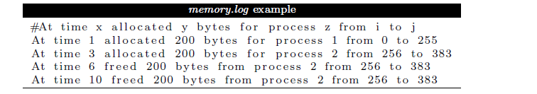
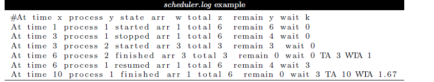
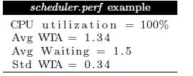

#  🖥️ Operating System Scheduler and Memory Allocator

## Table of Contents
- [Introduction](#introduction)
- [Getting Started](#getting-started)
  - [Prerequisites](#prerequisites)
- [Usage](#usage)
- [Output](#🚀-Output)  
- [Algorithms Used in schedualing ](#Algorithms-Used-in-the-scheduler)
- [Algorithm Used in memory Allocation](#Algorithm-Used-in-Memory-Allocation)
-[strucutre of the processes calling](#📰-processes-calling-structure)
- [Contributing](#contributing)
## Introduction

A CPU scheduler that determines an order for the execution of its scheduled processes. Operating System Scheduler decides which process will run according to a certain data structure that keeps track of the processes in the system and their status. In addition , a memory allocator that manages the computer memory and determines which process will be loaded into the memory and which process will be removed from the memory.

## Getting Started

1- Clone the repository
```bash
  git clone https://github.com/mtheggi/Operating-System-Scheduler.git
```

### Prerequisites

* you need to install linux on your machine or use a virtual machine
* download the following packages
```bash
  sudo apt-get install build-essential
  sudo dnf install gcc
```
## Usage

1- Compile the program
```bash
  make build 
```
2- generate testcases
```bash
  make testgenerate
```
3- run the program
```bash
  make run
```
4- choose the algorithm you want to run
| number to choose | algorithm | 
| -------- | -------- | 
| 1  |Non-preemptive Highest Priority First (HPF).  | 
| 2  |Shortest Remaining time Next (SRTN). | 
| 3  | Round Robin (RR).| 


## 🚀 Output 
* memory Log output 


* scheduler Log output


* scheduler statitics 





## Algorithms Used in the scheduler
### 1. Highest Priority First (Non-Preemptive)

In the **Highest Priority First (HPF)** scheduling algorithm, processes are scheduled based on their priority. The process with the highest priority is selected first for execution. This algorithm is non-preemptive, meaning once a process starts executing, it cannot be interrupted until it completes or yields the CPU voluntarily.

### 2. Round Robin Scheduling

**Round Robin Scheduling** is a simple and widely used time-sharing algorithm. Each process is assigned a fixed time slot or quantum, and they take turns executing in a circular order. If a process's execution is not completed within its time slot, it is moved to the back of the queue, allowing other processes to get CPU time.

### 3. Shortest Remaining Time First (SRTF)

**Shortest Remaining Time First (SRTF)** is a preemptive version of Shortest Job Next (SJN) scheduling. In SRTF, the process with the shortest remaining burst time is scheduled for execution. If a new process arrives with a shorter burst time than the currently executing process, the current process is preempted.

## Algorithm Used in Memory Allocation

### Buddy System

The **Buddy System** is a memory allocation algorithm that divides the available memory into fixed-size blocks. Each block is a power of two, and the system maintains a list of "buddy" blocks. When a process requests memory, the system allocates the smallest available buddy block that can accommodate the process's size. If the requested size is not an exact power of two, the system allocates the smallest buddy block that can hold the requested size and splits the larger block into two buddies.

## 📰 processes calling structure


## Contribution 
* Mohamed Tarek Heggi 
* Malek Essam Elsaka 
* Osama Nasser 
* hassan Hatem 

